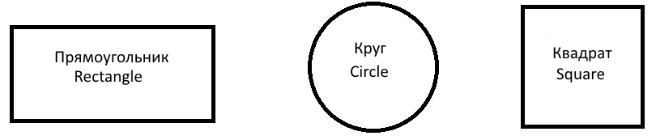

---
ispras_templates:
  header_ru: 'Обзор механизмов усиления защищенности операционных систем и пользовательских приложений'
  header_en: 'Overview of Hardening Mechanisms in Operating Systems and User Applications'

  authors:
    - name_ru: 'Д.В. Ефремов'
      name_en: 'D.V. Efremov'
      orcid: '0000-0002-9916-056X'
      email: '<efremov@ispras.ru>'
      organizations: [ispras]
      details_ru: >-
        Денис Валентинович ЕФРЕМОВ – старший научный сотрудник.
        Сфера научных интересов:
        формальная верификация, статический и динамический анализ.
      details_en: >-
        Denis Valentinovich EFREMOV – senior researcher.
        Research interests:
        formal verification, static and dynamic analysis.

    - name_ru: 'А.К. Петренко'
      name_en: 'A.K. Petrenko'
      orcid: '0000-0001-7411-3831'
      email: '<petrenko@ispras.ru>'
      organizations: [ispras, msu, hse]
      details_ru: >-
        Александр Константинович ПЕТРЕНКО — профессор, доктор физико-математических наук, заведующий отделом Технологий программирования ИСП РАН, профессор кафедр Системного программирования ВМК МГУ и ФКН НИУ ВШЭ.
        Научные интересы: формальные методы программной инженерии, языки спецификаций и моделирования, их применение для поддержки разработки и верификации программного обеспечения.
      details_en: >-
        Alexander Konstantinovich PETRENKO — Professor, Dr. Sci. (Phys.-Math.), Head of Software Engineering Department of the Ivannikov Institute for System Programming, Russian Academy of Sciences, Professor of the Department of System Programming, Faculty of Computational Mathematics and Cybernetics, Moscow State University and the Faculty of Computer Science, National Research University Higher School of Economics.
        Research interests: formal methods of software engineering, specification and modeling languages, and their use in software development and verification.

  bibliography: bibliography.bib

  # The converter inserts the non-breaking spaces Russian typography asks for —
  # initials, one-letter prepositions, numeric groups. Where no rule applies, as
  # in "ул. А. Солженицына, д. 25", the address lines below carry a literal
  # U+00A0 instead.
  organizations:
    - id: ispras
      name_ru:
        - 'Институт системного программирования им. В.П. Иванникова РАН,'
        - 'Россия, 109004, г. Москва, ул. А. Солженицына, д. 25.'
      name_en:
        - 'Ivannikov Institute for System Programming of the Russian Academy of Sciences,'
        - '25, Alexander Solzhenitsyn st., Moscow, 109004, Russia.'
    - id: msu
      name_ru:
        - 'Московский государственный университет имени М.В. Ломоносова,'
        - 'Россия, 119991, Москва, Ленинские горы, д. 1.'
      name_en:
        - 'Lomonosov Moscow State University,'
        - 'GSP-1, Leninskie Gory, Moscow, 119991, Russia.'
    - id: hse
      name_ru:
        - 'НИУ Высшая школа экономики,'
        - 'Россия, 101978, г. Москва, ул. Мясницкая, д. 20.'
      name_en:
        - 'National Research University Higher School of Economics,'
        - '20, Myasnitskaya ulitsa, Moscow, 101978, Russia.'

  abstract_ru: >-
    В данной работе представлен систематический обзор механизмов усиления защищенности (hardening) операционных систем и пользовательских приложений.
    Рассматриваются различные типы защитных механизмов, включая защиту потока управления, защиту памяти, механизмы изоляции, контроль целостности и противодействие аппаратным уязвимостям.
    Детально анализируются принципы работы данных механизмов, их эффективность и влияние на производительность систем.
    Особое внимание уделяется реализации защитных механизмов в современных операционных системах, в частности, в ядре Linux.
    Работа предназначена для специалистов в области информационной безопасности, разработчиков операционных систем и исследователей, занимающихся вопросами защиты информации.
  abstract_en: >-
    This paper presents a systematic review of hardening mechanisms for operating systems and user applications.
    Various types of protective mechanisms are examined, including control flow protection, memory protection, isolation mechanisms, integrity control, and hardware vulnerabilities mitigations.
    The principles of these mechanisms, their effectiveness, and their impact on system performance are analyzed in detail.
    Special attention is given to the implementation of protective mechanisms in modern operating systems, particularly in the Linux kernel.
    This work is intended for information security specialists, operating system developers, and researchers working on information security issues.

  # To remove paragraphs with unnecessary patterns, @none flag can be used.
    
  # keywords_ru: '@none'
  # keywords_en: '@none' 

  keywords_ru: 'защита информации, операционные системы, безопасность приложений, защита памяти, контроль целостности, изоляция, усиление защищенности'
  keywords_en: 'information security, operating systems, application security, memory protection, integrity control, isolation, security hardening, hardening'

  acknowledgements_ru: 'Работа поддержана компанией Лаборатории Касперского в рамках проекта «Анализ мирового уровня техники по архитектурным средствам обеспечения доверия».'
  acknowledgements_en: 'The work was supported by Kaspersky Lab as part of the project "Analysis of world-class technology in architectural means of ensuring trust".'

  # Optional. Auto-generated from the authors and the title if omitted.

  # for_citation_ru: 'Ефремов Д.В., Петренко А.К. Обзор механизмов усиления защищенности операционных систем и пользовательских приложений. Труды ИСП РАН, том 37, вып. 1, 2025 г., стр. 1-10.'
  # for_citation_en: 'Efremov D.V., Petrenko A.K. Overview of Hardening Mechanisms in Operating Systems and User Applications. Trudy ISP RAN/Proc. ISP RAS, vol. 37, issue 1, 2025, pp. 1-10.'

  # page_header_ru: 'Ефремов Д.В., Петренко А.К. Обзор механизмов усиления защищенности операционных систем и пользовательских приложений.'
  # page_header_en: 'Efremov D.V., Petrenko A.K. Overview of Hardening Mechanisms in Operating Systems and User Applications.'
---

## 1. Введение

<!--
=== TEMPLATE EXAMPLES ===
Below are examples of every construct the proceedings-md converter supports.
Uncomment and adapt as needed.
See proceedings-md/sample/sample.md and proceedings-md/sample/test-features.md for the upstream originals.
Do not nest HTML comments inside this block: they would terminate it early.

--- Heading levels ---

## 2. Заголовок первого уровня

### 2.1 Заголовок второго уровня

#### 2.1.1 Заголовок третьего уровня

--- Image with bilingual caption (image first, captions after) ---

The width attribute keeps the figure within the ISPRAS limit of 14 cm.
Pandoc also accepts inches, as in the upstream sample.

{width="14cm"}

::: img-caption
Рис. @ref:fig:example. Описание изображения.
:::

::: img-caption
Fig. @ref:fig:example. Image description.
:::

Cross-references also work in running prose.
Ссылки на рисунок в тексте статьи должны иметь вид "рис. @ref:fig:example".
Numbering is automatic and follows document order.

--- Table with bilingual caption (captions first, table after) ---

Captions are rendered by Pandoc, so they take the same inline markup as body text: bold, italic, inline code, math and links.
A caption may span several source lines.

::: table-caption
Табл. @ref:tab:example. Описание таблицы.
:::

::: table-caption
Table @ref:tab:example. Table description.
:::

| Column 1 | Column 2 | Column 3 |
|----------|----------|----------|
| Data 1   | Data 2   | Data 3   |

--- Code listing with bilingual caption (code first, captions after) ---

```c
int main(void) {
    return 0;
}
```

::: listing-caption
Листинг @ref:lst:example. Описание листинга.
:::

::: listing-caption
Listing @ref:lst:example. Listing description.
:::

--- Math formulas ---

Inline math is written as $n_{1}$.
A numbered display formula is right-aligned and carries its number after a backslash-hash.

$$\begin{array}{r}
U_{1} = n_{1}n_{1} + \frac{n_{1}\left( n_{1} + 1 \right)}{2} - R_{1};\#(1)
\end{array}$$

An unnumbered display formula needs no array wrapper.

$$E = mc^2$$

--- Lists ---

Bulleted lists use identical markers throughout.

- пример;
- маркированного;
- списка.

Numbered lists use a closing parenthesis, per the ISPRAS style.

1) пример;
2) нумерованного;
3) списка.

Nested lists need no special markup.

1. First ordered item
2. Second ordered item
   - Nested bullet item
   - Another nested item

--- In-text citation reference (biblatex-style) ---

This is discussed in detail in [@OpenBSD].
See also [@KSPP], [@Freund2015].

--- Typography ---

Prose is written with ordinary spaces.
The converter binds the pairs Russian typography does not let a line break on: a one-letter preposition to the next word, a reference word or an abbreviation to its number, a citation to the word before it, the parts of a numeric group, a number to its unit, initials to their surname, a dash to the word it follows, and the last short word of a paragraph to the one before it.
Так, "в разделе 7" и "рис. 4" уезжают на следующую строку целиком, а "[12, 13]" не разрывается посередине.

A backslash followed by a space still forces a non-breaking space where no rule applies, and it is never doubled.

To keep the spaces of one fragment exactly as typed:

[здесь пробелы остаются обычными]{.no-typography}

To switch the whole document off, add to the frontmatter:

  typography: false

=== END TEMPLATE EXAMPLES ===
-->

## 2. Заключение

# Список литературы / References
